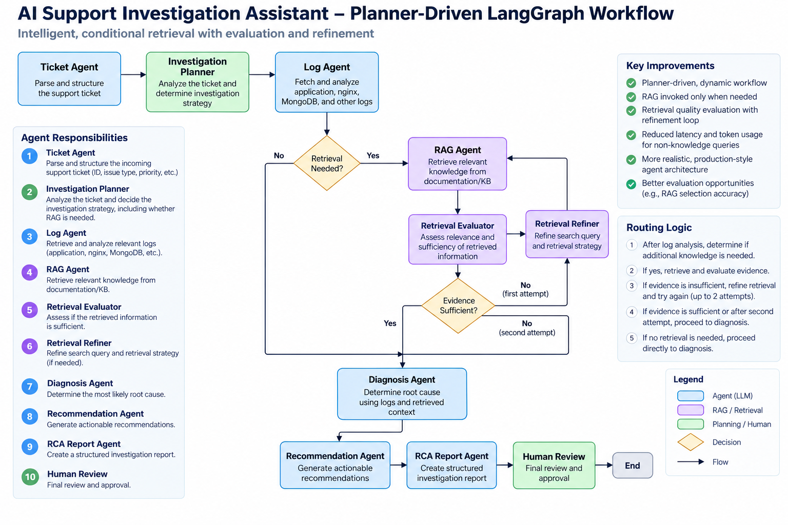
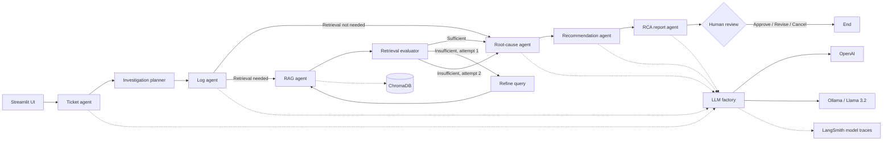

# Deep Agent Support Assistant

## Project Overview

This project demonstrates how to build, evaluate, and iteratively improve a planner-driven multi-agent support investigation workflow using LangGraph and LangSmith.

A state-driven support troubleshooting assistant built with LangGraph, LangChain, ChromaDB, and Streamlit. It analyzes a support ticket and optional application, Nginx, and MongoDB logs, retrieves relevant knowledge, produces a root-cause analysis, recommends actions, and pauses for human approval before finalizing the RCA.

The final **Week 4** project combines planner-driven conditional retrieval, LangSmith tracing, a 30-case golden dataset, and a calibrated semantic evaluation framework. The measured baseline uses **Llama 3.2 through Ollama** for all workflow agents.

## Architecture



Standalone Mermaid source: [docs/architecture.mermaid](docs/architecture.mermaid)

The Mermaid source follows.



Every node reads and writes the shared `SupportTroubleshootingState` TypedDict. The state includes structured outputs, errors, `current_agent`, `completed_steps`, observable `reasoning_summary` entries, and execution timing. The trace contains action summaries only; it never stores chain-of-thought or raw private model reasoning.

## Project layout

- `app/streamlit_app.py`: Streamlit entry point and workflow result display.
- `src/support_troubleshooting_agent/graph/`: Typed state and compiled LangGraph workflow.
- `src/support_troubleshooting_agent/agents/`: Ticket, log, RAG, diagnosis, recommendation, and report nodes.
- `src/support_troubleshooting_agent/models/llm_factory.py`: Central OpenAI/Ollama model selection.
- `src/support_troubleshooting_agent/rag/`: Existing ChromaDB ingestion, storage, and retrieval logic.
- `data/knowledge_base/`: Knowledge-base source documents.
- `data/vector_db/`: Local vector database data; ignored by git.
- `src/support_troubleshooting_agent/evaluation/`: Runner, semantic judges, and calibration utilities.
- `data/evaluation/`: Golden dataset and acceptance rubric; downloaded judge weights are ignored by git.
- `reports/evaluation/`: Baselines, per-case results, failure reviews, and experiment comparisons.
- `tests/unit/`: Agent, evaluator, and calibration tests.
- `docs/`: Supporting architecture documentation.

## Setup

Python 3.9 or newer is required.

```bash
git clone <repository-url>
cd deep-agent-support-assistant
python -m venv .venv
source .venv/bin/activate
python -m pip install --upgrade pip
python -m pip install -r requirements.txt
cp .env.example .env
```

```bash
streamlit run app/streamlit_app.py
```

The app opens at `http://localhost:8501`.

## LangSmith tracing

The Streamlit entry point loads `.env` automatically. To enable LangSmith tracing, add the following values to your local `.env` file:

```dotenv
LANGSMITH_API_KEY=your-langsmith-api-key
LANGSMITH_TRACING=true
LANGSMITH_PROJECT=support-agent-eval
LANGSMITH_ENDPOINT=https://api.smith.langchain.com
```

After starting the app and running an investigation, open the `support-agent-eval` project in LangSmith. A run should contain the LangGraph workflow and child runs for the model-backed agents. Do not commit `.env` or expose ticket, log, or API-key values in screenshots or traces. Use sanitized demo inputs when validating tracing.

## OpenAI configuration

Use OpenAI by setting an API key. The factory prefers OpenAI whenever `OPENAI_API_KEY` is present.

```dotenv
OPENAI_API_KEY=your-api-key
OPENAI_MODEL=gpt-4.1-mini
```

The application uses structured JSON responses for the model-backed agents. Keep `.env` local; it is ignored by git. Never put a real key in `.env.example`, source files, screenshots, or issue reports.

## Ollama configuration

Use a local Ollama model when `OPENAI_API_KEY` is absent.

1. Install Ollama from [ollama.com](https://ollama.com).
2. Start the Ollama service.
3. Pull the configured model:

```bash
ollama pull llama3.2
```

4. Configure the model in `.env`:

```dotenv
OLLAMA_MODEL=llama3.2
```

5. Start the app:

```bash
streamlit run app/streamlit_app.py
```

The factory checks that the Ollama service is reachable before returning the local chat model. If both provider configurations are present, OpenAI is selected by design.

## Retrieval data

Place knowledge documents under `data/knowledge_base/` and use the existing ingestion utilities in `src/support_troubleshooting_agent/rag/` to build or refresh the ChromaDB store. The workflow reuses the existing retriever and does not replace its vector-store implementation.

## Demo walkthrough

The repository includes synthetic, non-sensitive demo inputs:

- `data/tickets/demo1_ticket.json`: checkout incident ticket.
- `data/logs/demo/demo1_application.log`: application errors and database timeouts.
- `data/logs/demo/demo1_nginx.log`: HTTP 502/504 gateway failures.
- `data/logs/demo/demo1_mongodb.log`: slow queries and MongoDB connection failures.

To run the demo:

1. Complete the setup steps above and configure either OpenAI or Ollama.
2. Start the app with `streamlit run app/streamlit_app.py`.
3. Upload `data/tickets/demo1_ticket.json` in the **Support ticket** field.
4. Upload `demo1_application.log`, `demo1_nginx.log`, and `demo1_mongodb.log` from `data/logs/demo/` in their matching log fields.
5. Select **Start Investigation**.
6. Review the progress trace, retrieved knowledge, root-cause analysis, and recommendations.
7. At the human-review step, select **Approve**, **Revise**, or **Cancel**.

The expected demo signals are checkout timeouts, HTTP 5xx responses, elevated database wait time, and MongoDB connection or slow-query evidence. Exact model wording and retrieved documents may vary by provider and knowledge-base contents. The files contain fabricated identifiers and timestamps and are intended only for local demonstration.

## Decision-driven RAG workflow

### Previous workflow

The original graph always followed a fixed path:

```text
Ticket -> Log -> RAG -> Root Cause -> Recommendation -> Report -> Human Review
```

That meant every investigation attempted a knowledge-base lookup, even when the ticket and logs already contained sufficient evidence.

### Current workflow

The graph now adds an investigation planner immediately after ticket analysis. It uses the ticket, current state, and available logs to prepare the retrieval decision before log analysis completes:

```text
Ticket -> Planner -> Log
                          |
             +---------+---------+
             |                   |
         Skip RAG          Retrieve KB
             |                   |
             |           Evaluate retrieval
             |                   |
             |       Retry once if insufficient
             +----------> Root Cause -> Recommendation -> Report -> Human Review
```

The planner records `retrieval_needed`, `retrieval_query`, and an observable `investigation_decision`. When retrieval is selected, the evaluator checks returned document quality. A weak result routes through `retrieval_refiner` and back to the existing RAG retriever for a maximum of two attempts. If both attempts are insufficient, the graph proceeds to diagnosis with the KB evidence removed and records `continue_without_kb_evidence` in state.

The application is agentic at the retrieval boundary because these LangGraph conditional edges select the next action from the current state:

- `log_agent -> rag_agent` or `log_agent -> diagnosis_agent`, using the planner decision
- `retrieval_evaluator -> diagnosis_agent` or `retrieval_evaluator -> retrieval_refiner`
- `retrieval_refiner -> rag_agent` for the bounded query retry

This preserves the existing retriever and downstream agents while making knowledge lookup conditional, quality-aware, and bounded.

### Focused agent demos

Each scenario below is designed to emphasize one agent. The planner may skip retrieval; the listed stage should produce the most useful signal.

| Focus | Ticket | Optional log | What to observe |
| --- | --- | --- | --- |
| Ticket triage | `data/tickets/demo2_ticket_triage.json` | `data/logs/demo/demo2_triage_empty.log` as application logs | Priority, issue type, customer impact, and key facts in Ticket Summary |
| Log analysis | `data/tickets/demo3_ticket_logs.json` | `data/logs/demo/demo3_logs_gateway_errors.log` as application logs | HTTP 500/504 errors, timeout detection, and supporting evidence in Log Analysis |
| Knowledge retrieval | `data/tickets/demo4_ticket_retrieval.json` | `data/logs/demo/demo4_retrieval_indexing.log` as application logs | Retrieval query context and relevant documents in Retrieved Knowledge |
| Root-cause uncertainty | `data/tickets/demo5_ticket_uncertain.json` | Leave all log fields empty | Low confidence or insufficient-evidence diagnosis instead of an invented cause |
| Recommendations | `data/tickets/demo6_ticket_recommendations.json` | `data/logs/demo/demo6_recommendations_database.log` as application logs | Mitigation, validation, escalation, and preventative actions |

For each focused demo, upload the ticket in **Support ticket**, upload the optional log in **Application logs**, leave the other log fields empty, and select **Start Investigation**. Inspect the **Agent Execution Trace** to see which observable action each agent recorded. Results are hypotheses grounded in the supplied evidence, not proof of causality.

## Screenshots

Screenshots are not currently checked into this repository. To capture the running UI locally, start Streamlit and use the browser's screenshot tool at these states:

- Initial input screen with ticket and log upload controls.
- Investigation screen showing the progress status and workflow trace.
- Human review screen showing the generated RCA and Approve, Revise, and Cancel actions.
- Final results screen showing the RCA report and execution summary.

Do not capture API keys, customer data, or sensitive log contents. Store approved images under `docs/screenshots/` and reference them here with Markdown image links.

## Golden dataset

[`data/evaluation/golden_dataset.json`](data/evaluation/golden_dataset.json) contains **30 synthetic cases** with stable IDs, ticket text, expected diagnosis and recommendation criteria, difficulty, and category. Scenarios cover dependency failures, deployment regressions, authentication, storage, missing/conflicting evidence, and provider-related symptoms. References describe acceptable meaning rather than required wording. The runner supplies ticket text only; runtime failures described in tickets are not injected faults.

## Validation

### Evaluation framework

The default evaluator checks explicit semantic acceptance criteria using a pinned local [NLI cross-encoder](https://huggingface.co/cross-encoder/nli-deberta-v3-small). It compares meaning, not exact answer strings. The default judge runs locally; workflow provider calls and optional LangSmith tracing follow their configured settings. Install the dependencies from `requirements.txt`, then download the approximately 173 MB model once:

```bash
python -m support_troubleshooting_agent.evaluation.entailment --download
```

The model is pinned to revision `80dd65bdcda723aee9ed855dc1c3082d8b3e6842`; weights are checksum-verified. Its cache is excluded from Git. `EVAL_NLI_CACHE` can override the cache directory.

Run all 30 tickets through the unchanged LangGraph workflow, or regrade preserved answers without invoking agents:

```bash
python -m support_troubleshooting_agent.evaluation.runner --output reports/evaluation/new_run.json
python -m support_troubleshooting_agent.evaluation.runner --regrade reports/evaluation/recommendation_after.json --output reports/evaluation/regraded.json
```

`data/evaluation/judge_rubric.json` contains reference-derived criteria, with alternative natural-language formulations for each. Every required criterion must pass; alternative formulations within a criterion are OR conditions. The NLI entailment-score cutoff is 0.8. The rubric contains no predicted answers or review verdicts and is checked against the dataset references before execution. Scores are model outputs, not calibrated probabilities of correctness. The full answer is evaluated; inputs exceeding the model's 512-token pair limit produce a visible evaluation error rather than silent truncation. Use `--dataset`, `--rubric`, and `--output` for other corpora.

### Evaluation metrics

Each case records the predicted diagnosis, recommendation, workflow latency, token usage, and pass/fail or error status. Code performs aggregation, output-presence checks, latency measurement, token accounting, and reference/provenance checks. The JSON records criterion scores and alternatives, model revision, cutoff, and rubric hash. `failed` counts semantic failures; `errors` separately counts workflow and evaluation errors, with `passed: null` for ungraded cases. `pass_rate` is passed / graded and `grading_coverage` is graded / total. Both diagnosis and recommendation must pass. Results checkpoint after each case. Runner exit code is 0 only if every case passes, 1 for failures/errors, and 2 for invalid input.

Workflow chat token usage is reported separately from judge usage. The default NLI evaluator generates no chat tokens; its `grading.semantic_usage` records classification comparisons and input tokens, which are not LLM billing tokens. Workflow latency is preserved during regrading, and judge latency measures the new local evaluation. Token accounting excludes embeddings and hidden provider retries. The experimental `--judge-backend llm --judge-model MODEL` path retains structured outputs, source-quote validation, and bounded invalid-output retries, but it is not the trusted baseline evaluator.

### Baseline and calibration

Calibration uses frozen direct-review labels and prediction fingerprints in `reports/evaluation/manual_review.json`. Labels are compared only after grading and never enter the evaluator. Twelve representative cases were used for calibration; the other 18 were checked afterward without retuning the threshold:

```bash
python -m support_troubleshooting_agent.evaluation.calibration
python -m support_troubleshooting_agent.evaluation.calibration --split validation --output reports/evaluation/judge_validation.json
python -m support_troubleshooting_agent.evaluation.calibration --compare-only reports/evaluation/results.json --split all --output reports/evaluation/judge_audit.json
```

Calibration/audit exits 0 only when both dimensions match every reviewed label, so the known diagnosis-only mismatch on demo15 makes the validation/all audit exit 1 even though every overall case verdict agrees. The original pre-improvement baseline is **2/30 passes (6.7%)**, with **12/12 calibration** and **17/18 validation** cases agreeing on both dimensions, and **30/30 overall verdicts** agreeing with direct review. Manual review during evaluator calibration was not conducted by an independent human panel; criteria are benchmark-specific and the development sample is not an unbiased accuracy estimate. See [the full review and limitations](reports/evaluation/baseline_summary.md).

The runner loads `.env` for workflow provider configuration and stops at normal human review without approving reports. Golden cases provide ticket text only; provider outages and malformed outputs described in a ticket are not injected runtime faults. Agents, workflow routing, and the golden tickets were not changed during evaluator calibration.

### Local checks

Compile the workflow directly:

```bash
python -c "from support_troubleshooting_agent.graph.builder import build_workflow; print(build_workflow().get_graph().nodes)"
```

Run unit tests when pytest is installed:

```bash
python -m pytest -q
```

Provider construction can be checked without making a model request by setting `OPENAI_API_KEY` for the OpenAI branch. Ollama validation requires a running daemon and a pulled model; the factory intentionally reports a clear error when those prerequisites are unavailable.

## Evaluation Results

The final Week 4 automated baseline uses Llama 3.2 and the calibrated local semantic judge. See [per-case results](reports/evaluation/recommendation_after.json).

| Metric | Result |
| --- | ---: |
| Total cases | 30 |
| Workflow completion | 30/30 |
| Judge coverage | 30/30 |
| Workflow errors | 0 |
| Judge errors | 0 |
| Diagnosis passed | 15/30 (50%) |
| Recommendation passed | 5/30 (16.7%) |
| Overall pass rate | 16.7% |

Completion means the evaluation reached the normal human-review boundary, not that a report was approved. Both diagnosis and recommendation must pass for an overall pass. The remaining **25 failures are graded quality failures**, not runtime errors.

### Lessons Learned

LangSmith tracing, the golden dataset, and calibrated semantic evaluation revealed recommendation quality as the dominant improvement area, enabling targeted iteration while preserving a stable workflow.

### Failure analysis

Evaluation identified **recommendation generation as the primary remaining improvement area**: only five recommendations pass, compared with 15 diagnoses. The [experiment review](reports/evaluation/recommendation_comparison.md) highlights:

- **Recommendation coverage:** 18 cases received evidence-gathering-only guidance, including some with enough evidence for a repair, such as certificate expiration.
- **Component and diagnosis reasoning:** a symptom can be mistaken for the failing component; the Nginx 504 case needs investigation of the slow checkout upstream. Ambiguous and multiple-cause incidents remain difficult.
- **Recovery validation:** checks sometimes verify component health without explicitly proving the affected customer operation succeeds.
- **Evaluator limitations:** direct review flags likely false negatives for authentication, disk recovery, missing logs, and missing-ticket guidance, plus possible over-credit for DNS recovery. Automated grades remain unchanged.

Retrieval quality and planner routing remain investigation targets, but these results do not isolate their causal contribution. No observed workflow or judge runtime errors explain the remaining failures.

### Recommendation improvement experiment

Only the Recommendation Agent was improved; the evaluator, judge rubric, LangSmith integration, planner, diagnosis, workflow, and underlying Llama 3.2 model were held unchanged. Generation selects evidence-supported conditional remediation patterns, grounds component names in source text, and produces recovery checks with reasons, verification, and rollback guidance. Uncertain or unsupported cases fall back to evidence gathering.

| Measure | Before | Final |
| --- | ---: | ---: |
| Diagnosis passed | 15/30 (50%) | 15/30 (50%) |
| Recommendation passed | 2/30 (6.7%) | 5/30 (16.7%) |
| Overall pass rate | 6.7% | 16.7% |

MongoDB timeout, Redis timeout, Kafka lag, and DNS resolution cases improved. The missing-logs case regressed in the automated score, although direct review considers its evidence-gathering response appropriate. The net gain is **10 percentage points**. A later expanded-format experiment was rolled back; it is not the retained implementation.

See the [original baseline](reports/evaluation/recommendation_before.json), [comparison](reports/evaluation/recommendation_comparison.md), and [11-case direct review](reports/evaluation/recommendation_review.json).

### Final evaluation summary

The workflow completes reliably on all 30 benchmark cases, while recommendation quality remains the main constraint on measured pass rate. This is a measured automated baseline, not an error-free judgment of correctness: manual review during evaluator calibration was not conducted by an independent human panel, and the same development cases informed iteration. Independent review, unseen cases, and repeated runs are needed to assess generalization and stability.

## Suggested improvements

Future work, not implemented in Week 4:

- Expand evidence-grounded recommendation coverage and reduce unnecessary deferrals without inventing fixes.
- Improve component selection and require verification of the original customer operation after remediation.
- Independently review judge disagreements and validate improvements on held-out incidents and repeated runs.
- Measure retrieval relevance and planner routing separately before changing their behavior.

- Add a pinned lock file and CI matrix for supported Python versions and both providers.
- Add integration tests using disposable provider fakes plus a live Ollama smoke-test job.
- Persist LangGraph checkpoints so a browser refresh can resume human review safely.
- Replace the current Streamlit rerun flow with explicit session-state persistence for review actions.
- Add structured logging and metrics for node latency, retry counts, and fallback frequency.
- Add document ingestion status and source freshness metadata to the RAG UI.
- Add authentication and redaction before exposing the app outside a trusted environment.
