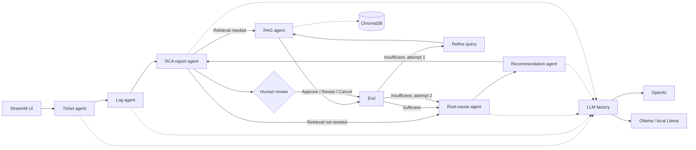

# Deep Agent Support Assistant

A state-driven support troubleshooting assistant built with LangGraph, LangChain, ChromaDB, and Streamlit. It analyzes a support ticket and optional application, Nginx, and MongoDB logs, retrieves relevant knowledge, produces a root-cause analysis, recommends actions, and pauses for human approval before finalizing the RCA.

## Architecture

Standalone Mermaid source: [docs/architecture.mermaid](docs/architecture.mermaid)

```text
Streamlit UI
    |
    v
Ticket agent -> Log agent -> Investigation planner
                            |
                   +----------+----------+
                   |                     |
               Skip RAG              Retrieve
                   |                     v
                   |             Retrieval evaluator
                   |                     |
                   |          Retry once or continue
                   +----------> Root-cause agent
                               |
                               v
Recommendation agent -> RCA report agent -> Human review -> End

RAG agent ---------> ChromaDB knowledge base
All model-backed agents -> LLM factory -> OpenAI or Ollama/local Llama
All agents share -> SupportTroubleshootingState (TypedDict)
```



Every node reads and writes the shared `SupportTroubleshootingState` TypedDict. The state includes structured outputs, errors, `current_agent`, `completed_steps`, observable `reasoning_summary` entries, and execution timing. The trace contains action summaries only; it never stores chain-of-thought or raw private model reasoning.

## Project layout

- `app/streamlit_app.py`: Streamlit entry point and workflow result display.
- `src/support_troubleshooting_agent/graph/`: Typed state and compiled LangGraph workflow.
- `src/support_troubleshooting_agent/agents/`: Ticket, log, RAG, diagnosis, recommendation, and report nodes.
- `src/support_troubleshooting_agent/models/llm_factory.py`: Central OpenAI/Ollama model selection.
- `src/support_troubleshooting_agent/rag/`: Existing ChromaDB ingestion, storage, and retrieval logic.
- `data/knowledge_base/`: Knowledge-base source documents.
- `data/vector_db/`: Local vector database data; ignored by git.

## Setup

Python 3.9 or newer is required.

```bash
git clone <repository-url>
cd deep-agent-support-assistant
python -m venv .venv
source .venv/bin/activate
python -m pip install --upgrade pip
python -m pip install -r requirements.txt
cp .env.example .env
```

```bash
streamlit run app/streamlit_app.py
```

The app opens at `http://localhost:8501`.

## LangSmith tracing

The Streamlit entry point loads `.env` automatically. To enable LangSmith tracing, add the following values to your local `.env` file:

```dotenv
LANGSMITH_API_KEY=your-langsmith-api-key
LANGSMITH_TRACING=true
LANGSMITH_PROJECT=support-agent-eval
LANGSMITH_ENDPOINT=https://api.smith.langchain.com
```

After starting the app and running an investigation, open the `support-agent-eval` project in LangSmith. A run should contain the LangGraph workflow and child runs for the model-backed agents. Do not commit `.env` or expose ticket, log, or API-key values in screenshots or traces. Use sanitized demo inputs when validating tracing.

## OpenAI configuration

Use OpenAI by setting an API key. The factory prefers OpenAI whenever `OPENAI_API_KEY` is present.

```dotenv
OPENAI_API_KEY=your-api-key
OPENAI_MODEL=gpt-4.1-mini
```

The application uses structured JSON responses for the model-backed agents. Keep `.env` local; it is ignored by git. Never put a real key in `.env.example`, source files, screenshots, or issue reports.

## Ollama configuration

Use a local Ollama model when `OPENAI_API_KEY` is absent.

1. Install Ollama from [ollama.com](https://ollama.com).
2. Start the Ollama service.
3. Pull the configured model:

```bash
ollama pull llama3.2
```

4. Configure the model in `.env`:

```dotenv
OLLAMA_MODEL=llama3.2
```

5. Start the app:

```bash
streamlit run app/streamlit_app.py
```

The factory checks that the Ollama service is reachable before returning the local chat model. If both provider configurations are present, OpenAI is selected by design.

## Retrieval data

Place knowledge documents under `data/knowledge_base/` and use the existing ingestion utilities in `src/support_troubleshooting_agent/rag/` to build or refresh the ChromaDB store. The workflow reuses the existing retriever and does not replace its vector-store implementation.

## Demo walkthrough

The repository includes synthetic, non-sensitive demo inputs:

- `data/tickets/demo1_ticket.json`: checkout incident ticket.
- `data/logs/demo/demo1_application.log`: application errors and database timeouts.
- `data/logs/demo/demo1_nginx.log`: HTTP 502/504 gateway failures.
- `data/logs/demo/demo1_mongodb.log`: slow queries and MongoDB connection failures.

To run the demo:

1. Complete the setup steps above and configure either OpenAI or Ollama.
2. Start the app with `streamlit run app/streamlit_app.py`.
3. Upload `data/tickets/demo1_ticket.json` in the **Support ticket** field.
4. Upload `demo1_application.log`, `demo1_nginx.log`, and `demo1_mongodb.log` from `data/logs/demo/` in their matching log fields.
5. Select **Start Investigation**.
6. Review the progress trace, retrieved knowledge, root-cause analysis, and recommendations.
7. At the human-review step, select **Approve**, **Revise**, or **Cancel**.

The expected demo signals are checkout timeouts, HTTP 5xx responses, elevated database wait time, and MongoDB connection or slow-query evidence. Exact model wording and retrieved documents may vary by provider and knowledge-base contents. The files contain fabricated identifiers and timestamps and are intended only for local demonstration.

## Decision-driven RAG workflow

### Previous workflow

The original graph always followed a fixed path:

```text
Ticket -> Log -> RAG -> Root Cause -> Recommendation -> Report -> Human Review
```

That meant every investigation attempted a knowledge-base lookup, even when the ticket and logs already contained sufficient evidence.

### Current workflow

The graph now adds an investigation planner after log analysis because the planner uses both the ticket summary and log evidence:

```text
Ticket -> Log -> Planner
                          |
             +---------+---------+
             |                   |
         Skip RAG          Retrieve KB
             |                   |
             |           Evaluate retrieval
             |                   |
             |       Retry once if insufficient
             +----------> Root Cause -> Recommendation -> Report -> Human Review
```

The planner records `retrieval_needed`, `retrieval_query`, and an observable `investigation_decision`. When retrieval is selected, the evaluator checks returned document quality. A weak result routes through `retrieval_refiner` and back to the existing RAG retriever for a maximum of two attempts. If both attempts are insufficient, the graph proceeds to diagnosis with the KB evidence removed and records `continue_without_kb_evidence` in state.

The application is agentic at the retrieval boundary because these LangGraph conditional edges select the next action from the current state:

- `investigation_planner -> rag_agent` or `investigation_planner -> diagnosis_agent`
- `retrieval_evaluator -> diagnosis_agent` or `retrieval_evaluator -> retrieval_refiner`
- `retrieval_refiner -> rag_agent` for the bounded query retry

This preserves the existing retriever and downstream agents while making knowledge lookup conditional, quality-aware, and bounded.

### Focused agent demos

Each scenario below is designed to emphasize one agent. The workflow still runs every stage, but the listed stage should produce the most useful signal.

| Focus | Ticket | Optional log | What to observe |
| --- | --- | --- | --- |
| Ticket triage | `data/tickets/demo2_ticket_triage.json` | `data/logs/demo/demo2_triage_empty.log` as application logs | Priority, issue type, customer impact, and key facts in Ticket Summary |
| Log analysis | `data/tickets/demo3_ticket_logs.json` | `data/logs/demo/demo3_logs_gateway_errors.log` as application logs | HTTP 500/504 errors, timeout detection, and supporting evidence in Log Analysis |
| Knowledge retrieval | `data/tickets/demo4_ticket_retrieval.json` | `data/logs/demo/demo4_retrieval_indexing.log` as application logs | Retrieval query context and relevant documents in Retrieved Knowledge |
| Root-cause uncertainty | `data/tickets/demo5_ticket_uncertain.json` | Leave all log fields empty | Low confidence or insufficient-evidence diagnosis instead of an invented cause |
| Recommendations | `data/tickets/demo6_ticket_recommendations.json` | `data/logs/demo/demo6_recommendations_database.log` as application logs | Mitigation, validation, escalation, and preventative actions |

For each focused demo, upload the ticket in **Support ticket**, upload the optional log in **Application logs**, leave the other log fields empty, and select **Start Investigation**. Inspect the **Agent Execution Trace** to see which observable action each agent recorded. Results are hypotheses grounded in the supplied evidence, not proof of causality.

## Screenshots

Screenshots are not currently checked into this repository. To capture the running UI locally, start Streamlit and use the browser's screenshot tool at these states:

- Initial input screen with ticket and log upload controls.
- Investigation screen showing the progress status and workflow trace.
- Human review screen showing the generated RCA and Approve, Revise, and Cancel actions.
- Final results screen showing the RCA report and execution summary.

Do not capture API keys, customer data, or sensitive log contents. Store approved images under `docs/screenshots/` and reference them here with Markdown image links.

## Validation

Compile the workflow directly:

```bash
python -c "from support_troubleshooting_agent.graph.builder import build_workflow; print(build_workflow().get_graph().nodes)"
```

Run unit tests when pytest is installed:

```bash
python -m pytest -q
```

Provider construction can be checked without making a model request by setting `OPENAI_API_KEY` for the OpenAI branch. Ollama validation requires a running daemon and a pulled model; the factory intentionally reports a clear error when those prerequisites are unavailable.

## Suggested improvements

These are intentionally not implemented in the current pass:

- Add a pinned lock file and CI matrix for supported Python versions and both providers.
- Add integration tests using disposable provider fakes plus a live Ollama smoke-test job.
- Persist LangGraph checkpoints so a browser refresh can resume human review safely.
- Replace the current Streamlit rerun flow with explicit session-state persistence for review actions.
- Add structured logging and metrics for node latency, retry counts, and fallback frequency.
- Add document ingestion status and source freshness metadata to the RAG UI.
- Add authentication and redaction before exposing the app outside a trusted environment.
